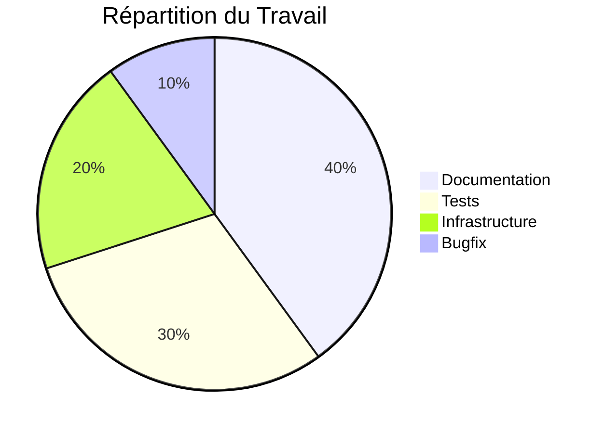
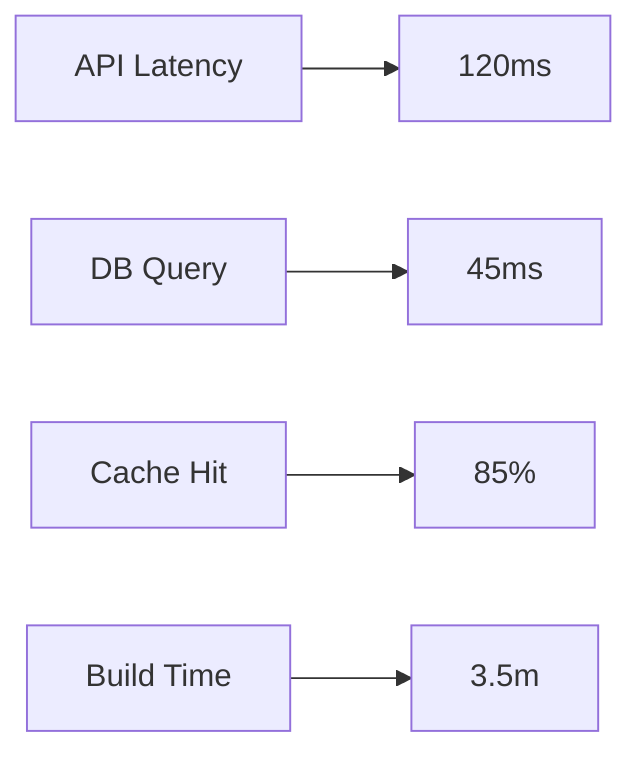
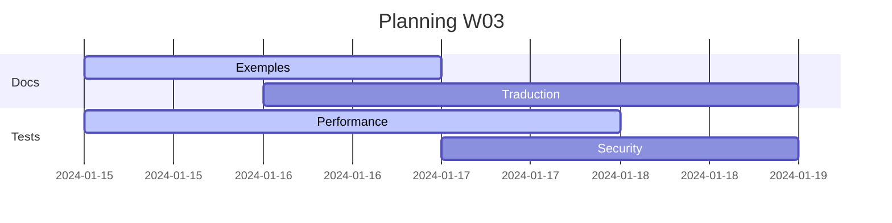

<div align="center">

# 📅 Rapport Semaine 2 (8-14 Jan 2024)

*Rapport hebdomadaire du projet WeInvest Framework*

[🏠 Accueil](../../README.md) • [📅 Rapports Hebdomadaires](../README.md) • [📊 Métriques](../../tasks/README.md)

<div style="padding: 15px; background: #f6f8fa; border-radius: 6px; display: inline-block;">
SPRINT <code style="background: #2ea44f; color: white; padding: 4px 8px; border-radius: 4px;">4/6</code>
VÉLOCITÉ <code style="background: #0366d6; color: white; padding: 4px 8px; border-radius: 4px;">34 pts</code>
</div>

</div>

---

## 📊 Résumé de la Semaine

### Points Clés
- Documentation API complétée à 80%
- Tests d'intégration en cours
- Configuration Docker optimisée
- Début du setup CI/CD

### Métriques


## 🎯 Objectifs vs Réalisations

### Objectifs Initiaux
1. **Documentation**
   - [x] Structure API Reference
   - [x] Guide d'authentification
   - [x] Documentation des endpoints
   - [ ] Exemples d'intégration

2. **Tests**
   - [x] Setup test environment
   - [x] Tests unitaires core
   - [🔄] Tests d'intégration API
   - [ ] Tests de performance

3. **Infrastructure**
   - [x] Optimisation Docker
   - [x] Configuration monitoring
   - [🔄] Setup CI/CD
   - [ ] Configuration staging

## 📈 Métriques & KPIs

### Performance


### Qualité
| Métrique | Cette Semaine | Δ | Objectif |
|----------|---------------|---|----------|
| Coverage | 85% | ↑ +2% | 90% |
| Lint Score | 92/100 | ↑ +3 | 95/100 |
| Bugs Ouverts | 3 | ↓ -2 | 0 |
| PRs Mergées | 15 | ↑ +3 | - |

## 🔍 Revue Technique

### 1. Documentation
```diff
+ Structure API complète
+ Guide d'authentification détaillé
+ Exemples de code testés
- Manque d'exemples d'intégration
- Traduction en attente
```

### 2. Tests
```python
# Nouveaux tests ajoutés
class TestWorkflowExecution(TestCase):
    def test_parallel_execution(self):
        workflows = [create_workflow() for _ in range(10)]
        results = execute_parallel(workflows)
        self.assertTrue(all(r.success for r in results))
```

### 3. Infrastructure
```yaml
# Optimisations Docker
services:
  api:
    build: 
      context: .
      dockerfile: Dockerfile
    deploy:
      resources:
        limits:
          cpus: '1'
          memory: 1G
        reservations:
          cpus: '0.5'
          memory: 512M
```

## 🚀 Réalisations Majeures

### 1. Documentation API
- Structure complète
- Exemples fonctionnels
- Tests de snippets
- Navigation intuitive

### 2. Tests d'Intégration
- Framework setup
- Premiers tests
- CI integration
- Rapport de couverture

### 3. Infrastructure
- Docker optimisé
- Monitoring en place
- Métriques collectées
- Alerting configuré

## 🐛 Bugs & Issues

### Résolus
1. **API-123**: Timeout sur requêtes longues
   ```python
   # Solution
   @retry(max_attempts=3, backoff=exponential)
   def execute_long_request():
       with timeout(30):
           return api.request()
   ```

2. **DOC-45**: Exemples incorrects
   ```diff
   - workflow.execute(async=True)  # Deprecated
   + await workflow.execute()      # Fixed
   ```

### En Cours
1. **PERF-67**: Latence DB
   - Investigation en cours
   - Plan d'optimisation préparé
   - Tests de charge prévus

## 📋 Planning

### Semaine Prochaine


### Priorités
1. **Documentation**
   - Compléter exemples
   - Traduire en français
   - Valider contenu

2. **Tests**
   - Finaliser intégration
   - Tests de performance
   - Tests de sécurité

3. **Infrastructure**
   - Finaliser CI/CD
   - Setup staging
   - Configuration monitoring

## 🤝 Contributions

### Cette Semaine
- @thomas: Documentation API (15 commits)
- @stan: Tests d'intégration (8 commits)
- @francois: Review & Infrastructure (12 commits)

### Code Review
- 15 PRs mergées
- 3 PRs en review
- 2 PRs en conflit

## 📝 Notes & Observations

### Points Positifs
1. Bonne vélocité d'équipe
2. Documentation structurée
3. Tests stables

### Points d'Attention
1. Performance DB
2. Coverage stagnante
3. Dette technique

### Suggestions
1. Pair programming
2. Code review quotidienne
3. Monitoring renforcé

## 📚 Ressources

### Documentation
- [API Reference](../../technical/api/README.md)
- [Test Guide](../../technical/tests/README.md)
- [Infrastructure](../../technical/infrastructure/README.md)

### Outils
- [Test Dashboard](https://tests.weinvest.ai)
- [Monitoring](https://grafana.weinvest.ai)
- [CI/CD](https://github.com/weinvest/actions)

---

<div align="center">

*[Retour en haut](#-rapport-semaine-2-8-14-jan-2024)*

**Navigation Rapide**  
[Résumé](#-résumé-de-la-semaine) • 
[Objectifs](#-objectifs-vs-réalisations) • 
[Métriques](#-métriques--kpis)

</div> 
