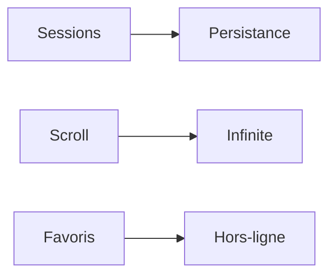
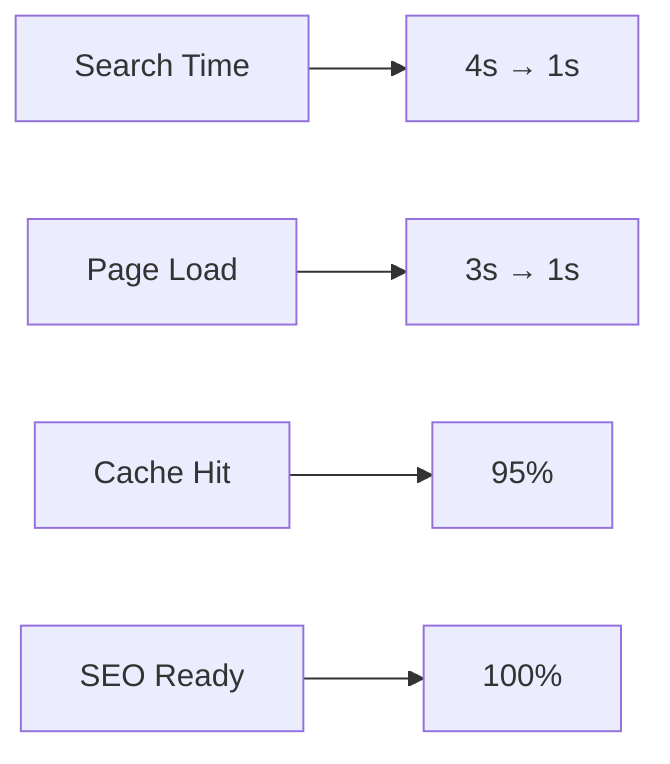
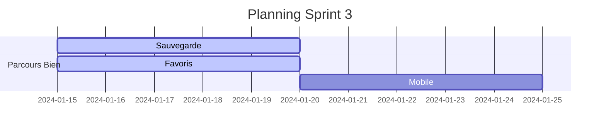

<div align="center">

# 📅 Rapport Sprint 2 - Restructuration WeInvest (Déc 2023)

*Rapport de Sprint du projet WeInvest Framework*

[🏠 Accueil](../../README.md) • [📅 Rapports de Sprint](../README.md) • [📊 Métriques](../../tasks/README.md)

<div style="padding: 15px; background: #f6f8fa; border-radius: 6px; display: inline-block;">
SPRINT <code style="background: #2ea44f; color: white; padding: 4px 8px; border-radius: 4px;">2/6</code>
PERFORMANCE <code style="background: #0366d6; color: white; padding: 4px 8px; border-radius: 4px;">-75% temps</code>
</div>

</div>

---

<details>
<summary><kbd>🔍 Contexte et Problématiques Initiales</kbd></summary>

### Architecture PostgreSQL
- Base de données choisie pour sa flexibilité
- Limitations critiques avec Bubble identifiées

### Problèmes Identifiés
1. **Chargement Dynamique Inefficace**
   - Chargement post-rendu de page
   - Expérience utilisateur saccadée
   
2. **Redondance des Requêtes**
   - Triple appel des données
   - Surcharge inutile

3. **Sous-utilisation Bubble**
   - Fonctionnalités natives ignorées
   - Opportunités d'optimisation manquées
</details>

<details>
<summary><kbd>🎯 Implémentation du Système de Cache</kbd></summary>

### Synchronisation Intelligente
- Cache sélectif des biens disponibles
- Double synchronisation staging/production
- Optimisation des ressources

### Standardisation Données
- Mapping PostgreSQL ↔ Bubble
- Réorganisation photos automatique
- Adaptation structure données
</details>

<details>
<summary><kbd>⚡ Optimisation Page Biens</kbd></summary>

### Refonte Technique
```diff
+ Nouvelle structure d'appels
+ Automatisation migration
+ URLs SEO (slugs)
```

### Métriques Performance
- Chargement : 3s → 1s
- SEO : Indexation optimisée
- URLs : Structure optimale
</details>

<details>
<summary><kbd>🔍 Système de Recherche</kbd></summary>

### Problématiques Résolues
- Élimination appels redondants
- Optimisation pagination
- Simplification architecture

### Améliorations Techniques


### Unification UX
- Interface unique adaptative
- Système d'alertes unifié
- Navigation contextuelle
</details>

## 📈 Métriques & KPIs

### Performance


### UX/UI
| Métrique | Avant | Après | Amélioration |
|----------|-------|-------|--------------|
| Temps Recherche | 4s+ | <1s | 75% |
| Chargement Page | 3s+ | <1s | 66% |
| Pages Dupliquées | 2 | 1 | 50% |

## 🚀 Réalisations Majeures

### Architecture
```diff
+ Système de cache intelligent
+ Mapping données optimisé
+ SEO natif implémenté
```

### Performance
- Réduction drastique temps de réponse
- Élimination requêtes redondantes
- Cache efficace

### UX/UI
- Navigation fluide
- Sessions persistantes
- Favoris hors-ligne

## 📋 Planning

### Sprint 3


### Sprint 4
1. **Module Agences**
   - Développement système agences
   - FAQ
   - Déploiement refonte

## 📝 Notes & Observations

### Points Forts
- Architecture scalable
- Performance optimale
- SEO natif

### Points d'Attention
1. Synchronisation données
2. Adaptation mobile
3. Parcours utilisateurs

---

<div align="center">

*[Retour en haut](#-rapport-sprint-2---restructuration-weinvest-déc-2023)*

**Navigation Rapide**  
[Contexte](#-contexte-et-problématiques-initiales) • 
[Cache](#-implémentation-du-système-de-cache) • 
[Optimisation](#-optimisation-page-biens)

</div>
